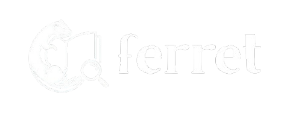
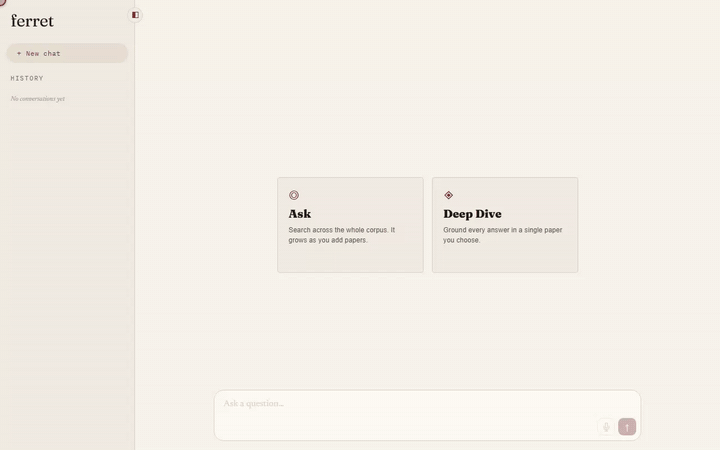
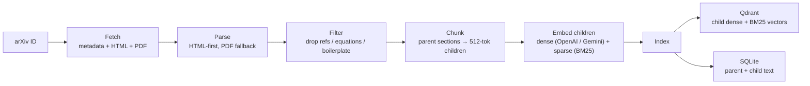
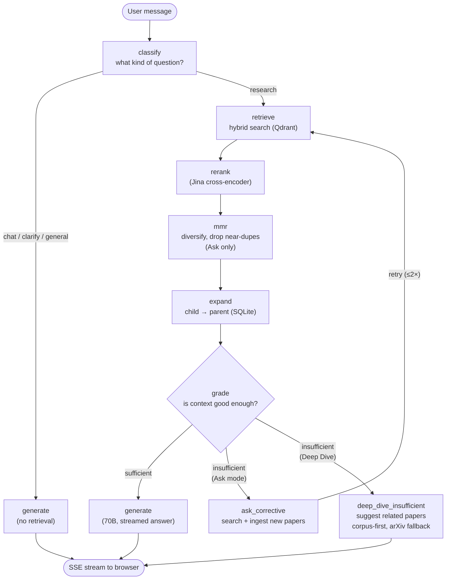

<p align="center">
  
</p>

<p align="center">
  Chat with arXiv research papers. Get answers grounded in real text, not guesses.
</p>

<p align="center">
  
  
  
  
  
  
</p>

<p align="center">
  
</p>

## Getting Started

**Prerequisites:** Python 3.11+, Node.js 18+, and accounts on **Groq**, **Jina AI**, **OpenAI** (or **Gemini**), and **Qdrant Cloud**.

```bash
# 1. Clone and enter the repo
git clone https://github.com/ibrahim-alii/ferret && cd ferret

# 2. Copy the env template and fill in your API keys
cp .env.example .env

# 3. Install the Python package (exposes the `ferret` CLI)
pip install -e ".[dev]"

# 4. Install frontend dependencies
cd frontend && npm install && cd ..

# 5. Initialize SQLite schema and Qdrant collection
ferret init

# 6. Start backend + frontend together
ferret dev
```

Open **http://localhost:3000** in your browser. The API runs at **http://localhost:8000**.

> At minimum, set `GROQ_API_KEY`, `OPENAI_API_KEY`, `JINA_API_KEY`, `QDRANT_URL`, and `QDRANT_API_KEY` in `.env`. To embed with Gemini instead of OpenAI, set `USE_LOCAL_EMBEDDINGS=true` and provide `GEMINI_API_KEY`. See [`.env.example`](.env.example) for the full, annotated list.

### Run with Docker

Prefer containers? You only need Docker, no local Python or Node. External services (Qdrant Cloud, OpenAI/Gemini, Groq, Jina) are still hosted, so a filled-in `.env` is required.

```bash
# 1. Copy the env template and fill in your API keys
cp .env.example .env

# 2. Build and start both containers (backend :8000, frontend :3000)
docker compose up --build

# 3. In a second terminal, initialize SQLite schema + Qdrant collection (once)
docker compose exec backend ferret init

# Ingest a paper inside the running backend container
docker compose exec backend ferret ingest <arxiv_id>

# Tear everything down (add -v to also wipe the persisted SQLite db + media)
docker compose down
```

Open **http://localhost:3000** in your browser; the API runs at **http://localhost:8000**. SQLite data and extracted figures persist in the `ferret-data` volume across rebuilds.

---

## How ferret Works

ferret has two chat modes built on the same retrieval backbone.

**Deep Dive**: paste an arXiv paper ID and have a focused conversation about that paper alone. Answers are strictly grounded in the ingested full text. When the context isn't enough to answer confidently, ferret surfaces related papers to explore instead of making something up.

**Ask**: chat freely across every paper you've ingested so far. When retrieval falls short, ferret searches arXiv, ingests the most relevant candidates on the fly, and retries before giving you an answer. Your knowledge base grows as you use it.

Either mode also supports **voice input**: tap the mic to dictate your question with live English speech-to-text (Chrome/Edge).

---

## The Retrieval Pipeline

This section is for people seeking deeper insight into how ferret is built; the strategies that have proven effective for grounded, low-hallucination answers over academic text.

Both modes share a **Corrective RAG (CRAG)** pipeline that runs end to end before any answer is streamed back to you.

### Ingestion



A paper is fetched (HTML preferred, PDF fallback), parsed into sections, filtered to drop references and equation-only noise, then split into two granularities: **parent** sections (stored whole in SQLite) and **~512-token child** chunks (embedded into Qdrant). Only children are embedded; dense vectors via OpenAI or Gemini, plus a BM25 sparse vector. Tables and figures stay atomic so a caption or markdown table is never cut in half.

### Query (the CRAG graph)



| Stage | What it does | Why |
|---|---|---|
| **classify** | Routes the message: chitchat, clarification, general, or a real research question | Avoids running expensive retrieval on "hi" or "what can you do?" |
| **retrieve** | Embeds the query, runs hybrid dense + BM25 search in Qdrant | Catches both "means the same thing" and "uses the exact term." Deep Dive filters to the chosen paper |
| **rerank** | Re-scores the top ~30 candidates with a cross-encoder, keeps the best ~5 | The cross-encoder reads query + chunk *together*, far more precise than vector distance alone |
| **mmr** | *(Ask mode only)* re-selects the top ~5 to trade a little relevance for diversity (λ=0.7), dropping near-duplicate chunks | Cross-corpus search surfaces near-identical chunks from similar papers; Deep Dive is single-paper so it's skipped |
| **expand** | Swaps surviving child chunks for their full parent sections | Small-to-big: the model reasons over complete arguments, not 512-token fragments |
| **grade** | Decides whether the context is good enough to answer | Two thresholds + a cheap LLM tie-breaker; cheap when obvious, smart when borderline |
| **generate** | Streams the final answer with the 70B model and emits citations | Only stage that uses the large model; output streams token-by-token over SSE |
| **ask_corrective** | *(Ask mode, weak retrieval)* generates arXiv queries, ingests new papers, retries | The "corrective" in CRAG; the corpus grows to answer the question, then retries (≤ 2×) |
| **deep_dive_insufficient** | *(Deep Dive, weak retrieval)* suggests related papers instead; cross-corpus retrieval surfaces the most relevant *already-ingested* papers (excluding the current one), falling back to an arXiv search only when the corpus has nothing else | In single-paper mode it stays honest rather than hallucinating; suggestions you can already open beat generic keyword hits |

The grading step is what separates ferret from a naive RAG setup. Rather than always generating an answer regardless of retrieval quality, it **decides first**. A reranked score above `0.6` is answered straight away; below `0.35` is treated as insufficient; anything in between is handed to a small, fast model that judges relevance directly. Cheap when the call is obvious, smart only when it's genuinely borderline.

When the context is weak, the two modes diverge by design. **Ask mode self-heals**: it writes fresh arXiv search queries, ingests the most relevant new papers on the fly, and loops back through retrieval up to twice before answering. **Deep Dive stays strictly grounded**: it can't pull in outside content to *answer*, so instead of guessing it surfaces related papers you might want to explore by running a cross-corpus search to recommend the most relevant papers already in your library (never the chunk text itself), and only reaching out to arXiv when nothing else in the corpus fits.

This is the whole point: ferret would rather tell you it doesn't have the answer, or go find more sources, than confidently make something up.

### Tech Stack

| Layer | Technology |
|---|---|
| **LLMs** | Groq: generation (70B), grading (smaller fast model) |
| **Embeddings** | OpenAI `text-embedding-3-small` (default) · Gemini `text-embedding-004` (`USE_LOCAL_EMBEDDINGS=true`) |
| **Vector DB** | Qdrant Cloud: dense + BM25 sparse vectors, server-side RRF fusion |
| **Reranker** | Jina AI cross-encoder |
| **PDF/HTML parsing** | arXiv HTML (primary) · PyMuPDF PDF fallback |
| **Chunking** | tiktoken: parent sections + ~512-token child chunks |
| **Backend** | FastAPI · LangGraph (CRAG graph) · SSE streaming |
| **Frontend** | Express · vanilla JS |
| **State DB** | SQLite via SQLAlchemy async + aiosqlite |

---

### Why Hybrid Retrieval?

Dense embeddings are good at semantic similarity. BM25 sparse search is good at exact keyword matches, which matters a lot in technical and academic text (model names, equation references, author names). ferret runs both in parallel on Qdrant and fuses the results with **Reciprocal Rank Fusion (RRF) server-side**, so you get the benefits of both without the latency of two separate round-trips.

### Small-to-Big Context Expansion

Chunks are stored at retrieval size (~512 tokens) for precision but linked to their parent sections in SQLite. When a chunk scores well, ferret expands it back to its full section before generating. This means the model reasons over complete arguments, not isolated paragraphs; **match on the child, answer from the parent.**

### Pacing Embeddings Under Rate Limits

On the local/dev embedding path (Gemini, `USE_LOCAL_EMBEDDINGS=true`), the free tier limits embedding requests per minute, and each chunk counts as a request. Large papers can contain hundreds of chunks, which would otherwise trigger rate-limit errors during ingestion. ferret uses a token-bucket limiter (GEMINI_EMBED_RPM, default 95) to keep requests below the 100/minute free-tier limit. Ingestion remains reliable but runs at the configured rate, so large papers may take several minutes to process. During long waits, the ingest status line reports progress so the delay appears expected rather than stalled. The default production path (OpenAI embeddings) has much higher limits and does not require throttling.

---

## CLI Reference

Installing the package exposes the `ferret` command.

| Command | What it does |
|---|---|
| `ferret init` | Create the SQLite schema and Qdrant collection (idempotent) |
| `ferret serve` | Run the FastAPI backend (default `http://localhost:8000`) |
| `ferret web` | Run the Express frontend (default `http://localhost:3000`) |
| `ferret dev` | Run backend + frontend together; Ctrl-C tears down both |
| `ferret ingest <arxiv_id>` | Ingest a paper; add `--force` to repair Qdrant/SQLite drift |
| `ferret chat --mode ask` | Cross-corpus chat from the terminal |
| `ferret chat --mode deep_dive --paper-id <id>` | Single-paper chat from the terminal |
| `ferret eval --paper-id <id>` | Run the full RAG eval suite against an ingested paper |

---

## Testing

```bash
pytest                                    # backend unit tests (external APIs mocked)
pytest -m integration                     # real API calls (skipped by default)
pytest -m eval                            # full RAG eval suite (skipped by default)
pytest path/to/test_foo.py::test_name     # a single test

cd frontend && npm test                   # frontend unit tests (Vitest)
```

The eval suite produces retrieval (ranx), grading-accuracy, and generation (RAGAS) reports under `evals/reports/`. Run it with `pytest -m eval`, `python evals/run_all.py --paper-id <id>`, or `ferret eval --paper-id <id>`.

---

## License

[MIT](LICENSE) © 2026 Ibrahim Ali
